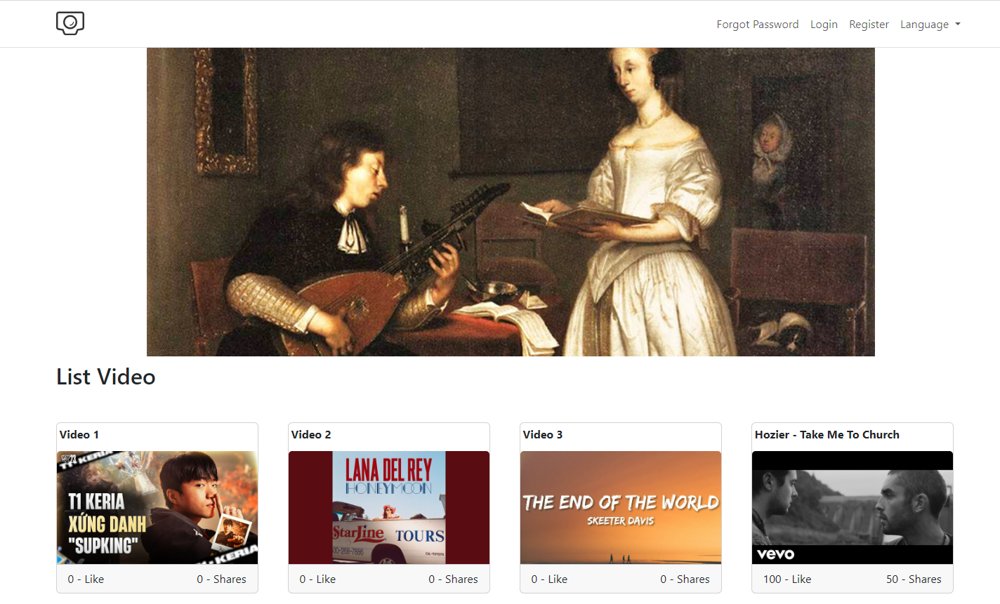

## VideoHup
The website contains many useful videos



## Installation

```bash
## Clone the repository
git clone https://github.com/Vanhuyne/Videohup.git

## Install dependencies
cd <project-name>

## Install dependencies using Maven:
    ```bash
mvn clean install

## Features
  .Register
  .Login
  .Forgot Password
  .Send Email
  .Change Language
  .Watch Videos

## Technologies Used

- Backend: Java, Tomcat
- Frontend: JSP/Servlet , Boostrap 5
- Database: SQLServer
